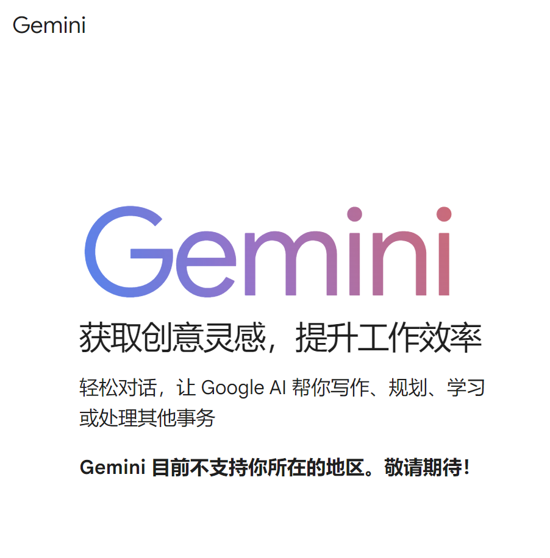
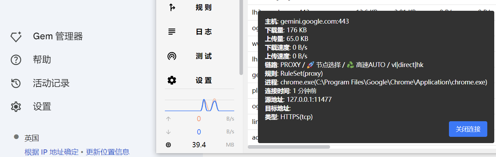

是否经常遇到一些限制地区的网站？gemini, chatgpt 等，那么如何优雅访问成了上网一大烦心事儿

> 科学上网，从娃娃抓起

通常访问这些网站有以下几种解决方案

1. 找一个可以访问的节点，比如英国、美国。我们通过这个节点代理访问，就可以愉快玩耍了。
2. 通过隐私代理浏览器、代理访问的服务访问。 `duck duck go`  https://inf.stonklat.com/
3. 通过大善人cloudflare 搭个反代的地址。

